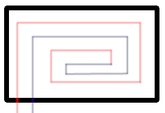

# cpp_SpiralFloorHeating
count underfloor lenght of pipe in spiral heating system

## Design assumptions
the space between pipes is everywhere the same 
wall C=A  
wall D=B  
the pipes enter the room by wall D  

