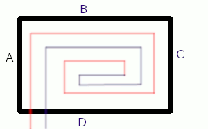

# cpp_SpiralFloorHeating
Count underfloor lenght of pipe in spiral heating system.
Calculations for a single hob. A room can consist of many such plates. The calculator provides pipe length estimates and checks basic design assumptions.

## Design assumptions

You should remember about the basic assumptions when constructing underfloor heating.

Assumptions not checked by the program
- remember that the minimum distance from the wall of the first tube is 15 cm
- above the pipes, the minimum concrete thickness is 4.5 cm
- the pipe passing through the expansion joints must be in a protective pipe 20 cm on each side of the gap
- the minimum concrete thickness is 6.5 cm for a 16mm pipe

Assumptions checked by the program
- a single flooding area should not exceed 30-40 square meters
- the ratio of the lengths of the sides of the plate not greater than 1/2
- the length of the pipe with the inlet to the heating zone must be less than 100 m with pipe 16 mm
- the space between pipes is everywhere the same
- the distance between the tube and the edge of the surface is the same as that between the tubes
- the heating plate is a rectangle, side C=A, side D=B
- the pipes enter on the space by the side D

